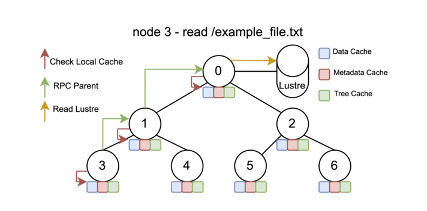

# Copper

Copper is a read-only cooperative caching layer for scalable metadata and data
reuse on large HPC systems. Its primary production use is reducing redundant
startup-time I/O, especially for Python imports and shared-library loading on
large node counts on Aurora and Frontier.

For ALCF Aurora Spack-based packaging and deployment guidance, see the
[copper-spack](https://github.com/argonne-lcf/copper-spack/) repository.

Additional documentation is available in the local
[documentation index](./docs/source/index.rst) and on:

- [Read the Docs](https://alcf-copper-docs.readthedocs.io/en/latest/)
- [Aurora copper-spack documentation](https://github.com/argonne-lcf/copper-spack/)
- [ALCF user guide](https://docs.alcf.anl.gov/aurora/data-management/copper/copper/)
- [OLCF user guide](https://docs.olcf.ornl.gov/software/UMS/index.html)
- [Aurora and Frontier Guide](./docs/source/guide_aurora_and_frontier.rst)
- [Overview and Best Practices](./docs/source/guide_overview_and_best_practices.rst)
- [Launch and Analysis Runbook](./docs/source/operations_launch_and_analysis_runbook.rst)
- [Environment Path Analysis](./docs/source/operations_environment_path_analysis.rst)
- [Metadata ENOENT TTL Evaluation](./docs/source/operations_metadata_enoent_ttl_evaluation.rst)
- [Examples Catalog](./examples/README.md)
- [Copper 1.0 Release Notes](./COPPER_1_0_RELEASE_NOTES.md)



The current distributed runtime focus is on `getattr`, `read`, and `readdir`.
The operations `open`, `release`, and `opendir` are lightweight compatibility
stubs for read-mostly workflows. Mutation-oriented operations such as `mkdir`,
`unlink`, `rename`, `create`, `write`, and `rmdir` are not the main production
target.

## How to Load the Copper Module

```bash
module load copper            # Aurora: commonly used with cxi0 and service cores 48,49,50,51
module load ums ums046 copper # Frontier: commonly used with cxi1 and service cores 1,2 or 1,2,65,66
```

## How to Start the Copper Service

```bash
launch_copper_aurora.sh  [-d log_dir_base] [-v CU_FUSE_MNT_VIEWDIR]
launch_copper_frontier.sh [-d log_dir_base] [-v CU_FUSE_MNT_VIEWDIR]
```

## How to Stop the Copper Service

```bash
stop_copper_aurora.sh  [-d log_dir_base] [-v CU_FUSE_MNT_VIEWDIR]
stop_copper_frontier.sh [-d log_dir_base] [-v CU_FUSE_MNT_VIEWDIR]
```

## How to Run an Application with Copper

### Aurora Example

```bash
module load copper
APP_BASE=/lus/flare/projects/datascience/${USER}/exp1
MY_COPPER_MOUNT=/tmp/${USER}/copper_mount

./build/launch_copper_aurora.sh -d ${APP_BASE}/copper-logs-dir -v ${MY_COPPER_MOUNT}

time mpirun --np ${NRANKS} --ppn ${RANKS_PER_NODE} \
  --cpu-bind=list:4:56:9:61:14:66:19:71:20:74:25:79 --genvall \
  --genv=PYTHONPATH=${MY_COPPER_MOUNT}${APP_BASE}/lus_custom_pip_env:$PYTHONPATH \
  python3 -c "import torch; print(torch.__file__)"

./build/stop_copper_aurora.sh -d ${APP_BASE}/copper-logs-dir -v ${MY_COPPER_MOUNT}
```

### Frontier Example

```bash
module load ums ums046 copper
APP_BASE=/lustre/orion/proj-shared/ums046/${USER}/exp1
MY_COPPER_MOUNT=/mnt/bb/$USER/copper_mount  # /tmp is also valid

./build/launch_copper_frontier.sh -d ${APP_BASE}/copper-logs-dir -v ${MY_COPPER_MOUNT}
conda activate ${MY_COPPER_MOUNT}${APP_BASE}/conda_env
CPU_BINDING_MAP=verbose,map_cpu:9,17,25,33,41,49,57,73

/usr/bin/time srun --overlap -N ${SLURM_NNODES} -n $((SLURM_NNODES * 8)) \
  --ntasks-per-node=8 --cpu-bind=${CPU_BINDING_MAP} \
  python3 -c "import torch; print('torch imported from:', torch.__file__)"

./build/stop_copper_frontier.sh -d ${APP_BASE}/copper-logs-dir -v ${MY_COPPER_MOUNT}
```

Platform-specific example scripts are provided under:

- [examples/aurora_examples](./examples/aurora_examples)
- [examples/frontier_examples](./examples/frontier_examples)

## Personal Environments

When using a personal Conda environment, prepending `/tmp/${USER}/copper/`
only to the path passed to `conda activate` is sufficient.

When using a Python virtual environment or custom package directory,
prepending Copper only to the `PYTHONPATH` entry that should flow through
Copper is usually sufficient.

## Runtime Layout

The job output directory typically contains:

- `logs/`
  Copper runtime logs, `node_file.txt`, the prepared job-local
  `copper_address_book.txt`, and supporting launch artifacts
- `logs/copper_address_book_full_output.txt`
  A preserved provenance artifact for address-book preparation
- `tables/final/`
  Final raw cache and table outputs
- `tables/<snapshot-tag>/`
  Tagged raw outputs such as `pre-destroy`
- `profiling/final/`
  Final per-rank profiling summaries and CSV files
- `profiling/<snapshot-tag>/`
  Tagged per-rank profiling snapshots
- `profiling/cluster/`
  Aggregated profiling outputs created by `scripts/aggregate_profiling.py`

## Address-Book Modes

Copper prepares a job-local address book before the full `cu_fuse` launch.
The wrapper supports two source modes:

- `facility`
  Filter a provided facility address book down to just the current allocation
- `discover`
  Run `build/list_cxi_hsn_thallium` across the allocation, preserve the raw
  discovery output, and derive the final hostname-to-endpoint mapping from the
  column selected by `net_type`

For `discover` mode, `net_type` must match one of the discovered endpoint
families. For example, `cxi://cxi1` selects the discovered `cxi1` column.

After build, the runtime wrappers default to the staged facility address-book
files in `build/`:

- `build/olcf_frontier_copper_addressbook.txt`
- `build/alcf_aurora_copper_addressbook.txt`

The repository keeps the source copies under `scripts/`, and the build copies
those files into `build/` so the launchers and modulefile use a consistent
runtime layout.

## Launch Wrapper Options

```bash
launch_copper_aurora.sh
launch_copper_frontier.sh

[-l log_level]                  # Copper log verbosity level: 0 no logging, 5 most logging
[-t log_type]                   # Copper log destination: file / stdout / both
[-d log_dir_base]               # Base directory for job outputs
[-T trees]                      # Number of overlay trees
[-M max_cacheable_byte_size]    # Maximum request size that Copper will cache
[-E md_enoent_ttl_ms]           # Exact-path metadata ENOENT TTL in milliseconds
[-P]                            # Enable aggregate profiling outputs
[-N profile_top_n]              # Enable top-path profiling with top-N retention
[-A]                            # Enable full-path profiling outputs
[-I profile_snapshot_interval]  # Periodic profiling snapshot interval in seconds
[-s sleeptime]                  # Sleep after launching Copper before the workload starts
[-b physcpubind]                # CPU cores where each cu_fuse process should run
[-F facility_address_book]      # Path to the facility address book file
[-a address_book_source]        # facility / discover
[-n net_type]                   # Network endpoint selector
[-v CU_FUSE_MNT_VIEWDIR]        # Mount path where Copper is exposed
```

## Building Copper

Copper depends on the Mochi communication stack and a working FUSE3
installation. A typical build environment provides:

- `cmake`
- an MPI compiler toolchain
- `margo`
- `mercury`
- `thallium`
- `argobots`
- `cereal`

Example build flow:

```bash
module load gcc-native/14.2
module load cmake
source /sw/frontier/ums/ums046/spack/share/spack/setup-env.sh
spack env activate spack-copper-mod-env

cd /path/to/copper/scripts
cp default_env.sh env.sh
sh build_helper/build.sh
```

Expected build artifacts include:

- `build/cu_fuse`
- `build/cu_fuse_shutdown`
- `build/list_cxi_hsn_thallium`
- `build/launch_copper_aurora.sh`
- `build/launch_copper_frontier.sh`
- `build/stop_copper_aurora.sh`
- `build/stop_copper_frontier.sh`
- `build/olcf_frontier_copper_addressbook.txt`
- `build/alcf_aurora_copper_addressbook.txt`
