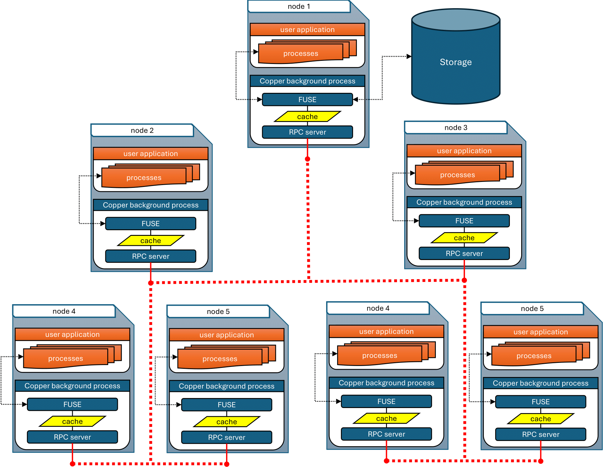
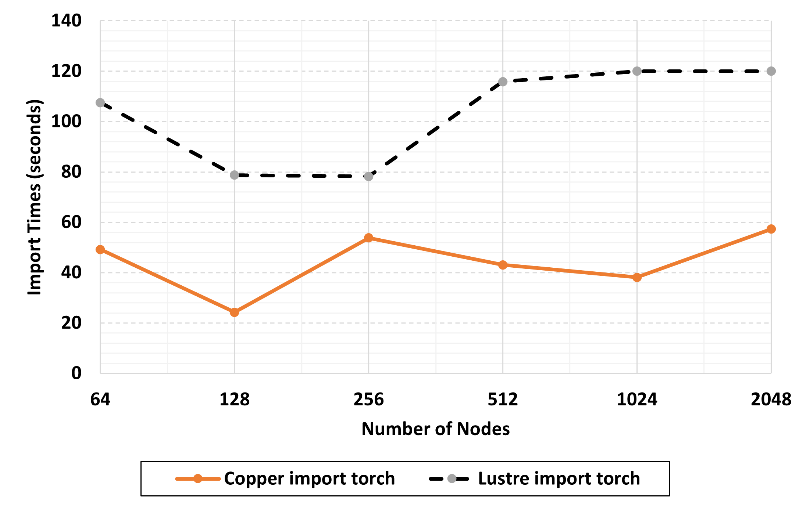

Copper
====================

Cooperative Caching Layer for Scalable Data Loading on Exascale Supercomputers
---------------------

Motivation
^^^^^^^^^^^^^^^^^^^^^^

Job initialization time of dynamic executables increases as HPC jobs launch on larger numbers
of nodes and processes. This is due to the processes flooding the storage system with tremendous
amounts of I/O requests for the same files leading to significant performance degradation causing
the nodes to remain idle for an extended period of time waiting for I/O resources wasting
valuable CPU cycles. In order to remove the I/O bottleneck occurring at job initialization time,
a data loader capable of reducing storage side congestion is necessary. We introduce Copper,
a read-only cooperative caching layer aimed to enable scalable data loading on massive amounts
of nodes. Our experiments show that Copper is able to provide near constant time loading when
scaling up to 2,048 nodes.

Architecture
^^^^^^^^^^^^^^^^^^^^^^

.. raw:: html

     

The above image shows the high-level view of Copper's architecture which consist of an RPC
overlay network working in conjunction with a FUSE layer. Only the root node performs I/O
against the underlying storage. I/O requests, file data, file metadata, and directory to
child-entries are shared through the overlay network through RPC communications represented
by the red dotted lines.

Results
^^^^^^^^^^^^^^^^^^^^^^

The results presented are obtained with the Aurora supercomputer located at Argonne National Laboratory.
The Aurora supercomputer has 10,624 nodes with a total of 166 racks with 21,248 CPUs and 63,744
GPUs. The nodes each have 2 Intel Xeon CPU Max Series equipped with 52 physical cores supported 2
hardware threads per core. Each CPU has 512GB of DDR5. The system is connected in a dragonfly topology
and each node has 8 HPE Slingshot-11 NICs. Copper will only use a single NIC on each node. During the 
testing period, Aurora is currently in a pre-production state and under various types of testing and
configuration by vendor staff. As such, the storage system were not always operating within the most
stable conditions as can be seen with the baseline results.

.. raw:: html

     

This test case is to evaluate importing a complex python module, PyTorch. The test launches 
``python -c 'import pytorch'`` via ``mpiexec`` and times the entire runtime for the 
execution. The above figure shows the times observed when importing PyTorch 
on 32 to 2,048 nodes while running 12 Python processes per node. As can be seen, Copper, 
represented by the orange solid line, provides a significant performance improvement compared to 
Lustre, represented by the orange dotted line, decreasing import times by 60 seconds when using 
2,048 nodes. This effectively halves the time needed to import the PyTorch module.

.. toctree::
   :maxdepth: 2
   :caption: Contents:

   building_and_running

